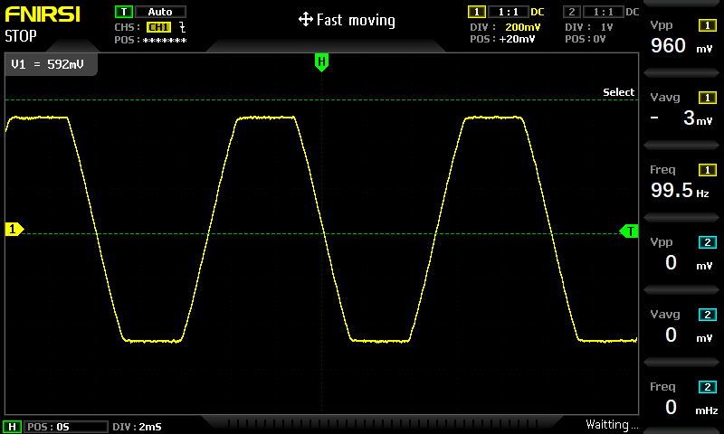
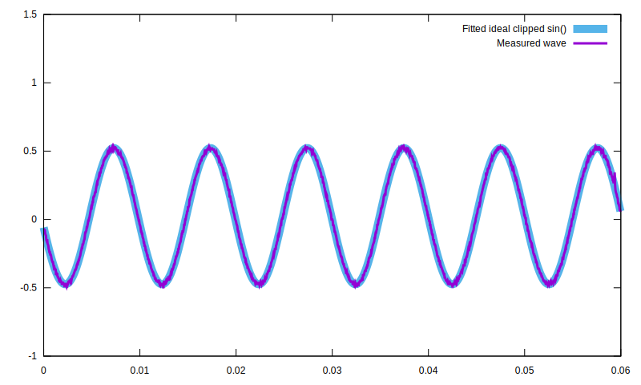
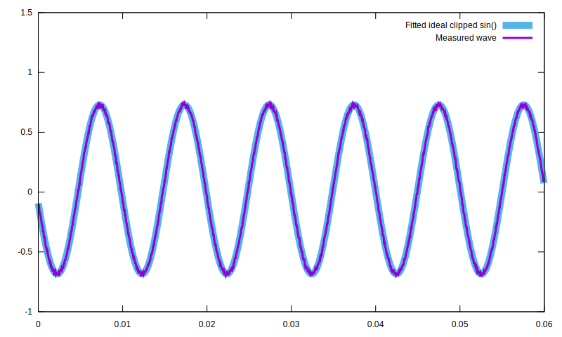
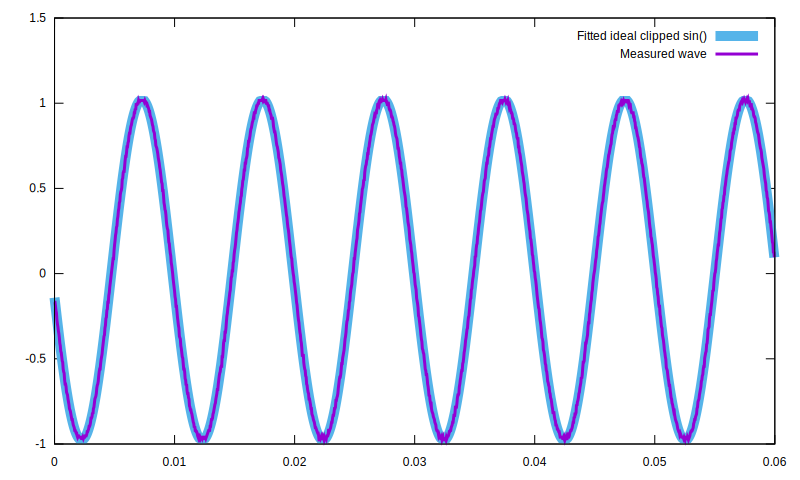
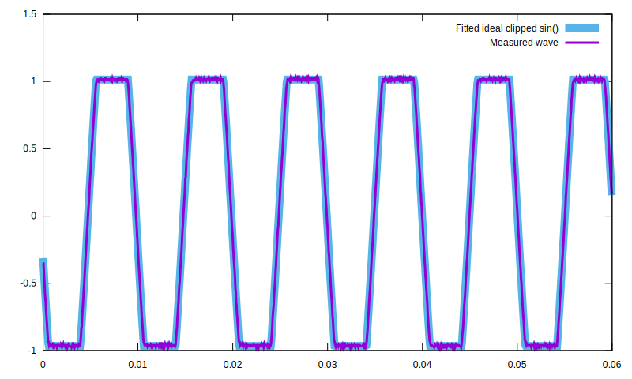

# Adafruit MAX98357 Gain

The Adafruit MAX98357 module is a tiny little wonder. It includes both a DAC and an audio amplifier in a ridiculously small package that provides great audio quality, a fair amount of power and doesn't overheat.

However... I was left scratching my head trying to understand its gain control. "The default gain seems loud enough and sounds good" is not a good enough explanation for the engineer in me. I needed facts, data!
How exactly does this gain change the mapping from the input PCM data I send to the chip to the final signal that goes out to the speaker? Can I set the highest gain level without worrying about clipping? When exactly
does clipping occur? Which level gets me the most power out of the 5V supply?

Coudln't find any page giving me clear enough answers. So I did my own experiments and wrote this one with my findings.

You may want to skip directly to the [detailed conclusions](#detailed-conclusions) or to the [quick ones](#quick-conclusions).

## Measurements

### Test Circuit


I put together a very simple no-load test circuit consisting of a high impedance voltage divider with a capacitor in parallel to act as a lowpass. The lowpass is needed because I wanted to observe the audible waveform
(which should resemble the PCM data I send to the chip) instead of the high-frequency (330kHz) PWM waves the chip uses to drive the speaker.

Hooked it up to an oscilloscope and tested all the available gain settings while playing a 100Hz full amplitude sine signal:

| 3dB | 6dB | 9dB | 12dB | 15dB |
| --- | --- | --- | ---- | ---- |
|  |  |  |  |  |

Is it just me or the 12db and 15db ones look a tiny wee bit saturated? X'D

### Numerical analysis

Seeing the measurements in the oscilloscope was of course not enough for me. I needed hard numerical evidence.

So I exported the capture data from the oscilloscope and setup a gnuplot script to fit an ideal clipped sin function to each of the measurements.

Fitted function definition:
```gnuplot
PI=3.14159
min(a,b)=a>b ? b : a
max(a,b)=a>b ? a : b
db2amp(db)=10^(db/20)
amp2db(amp)=20*log(amp)/log(10)
f(x,frequency,phase,clip,gain,dc_offset)=min(clip, max(-clip, sin(x*2*PI*frequency+phase*2*PI) )) * gain + dc_offset
```

Results:

| 3dB | 6dB | 9dB | 12dB | 15dB |
| --- | --- | --- | ---- | ---- |
|  |  |  |  |  |
| Freq: 99.43 | Freq: 99.47 | Freq: 99.48 | Freq: 99.44 | Freq: 99.44 |
| Phase: 0.57 | Phase: 0.57 | Phase: 0.53 | Phase: 0.57 | Phase: 0.53 |
| Clip: -0.01dB | Clip: -0.01dB | Clip: -0.08dB | Clip: -3.08dB | Clip: -6.05dB |
| Gain: -6.05dB | Gain: -3.01dB | Gain: 0.00dB | Gain: 2.98dB | Gain: 5.96dB |
| DC offset: 0.02 | DC offset: 0.02 | DC offset: 0.02 | DC offset: 0.02 | DC offset: 0.02 |

## Conclusions

### Detailed conclusions
The MAX98357 gain works by amplifying the input PCM signal before encoding to PWM. For that reason there's no setting that cannot be replicated exactly using the 9dB setting and applying an equivalent
gain to the PCM data before sending to the chip.

* with 9dB gain, a full excursion in the input PCM amplitude translates to a full excursion in the dutty cycle of the output PWM waves, resulting in maximal loudness without clipping.
* 3dB and 6dB settings will result in lower volume. These modes can never achieve more than a 50% or a 70% dutty cycle, respectively.
* 12dB and 15dB amplify the input signal by 3db and 6dB respectively, causing all sound above -3db or -6dB to clip.

It's still a mistery to me why they used these names for the different modes. -6db, -3db, 0dB, 3dB and 6dB would make a lot more sense and might have saved me some head scratching.

Also... why did they make a chip that clips audio on purpose? I guess it must be some sort of convenience functionality to cope with quiet sounds on systems where controling gain in software is not an option.

### Quick conclusions
The default 9dB gain setting is the only one you should ever use. Leave the gain pin always unconnected and forget the chip even has gain functionality.
